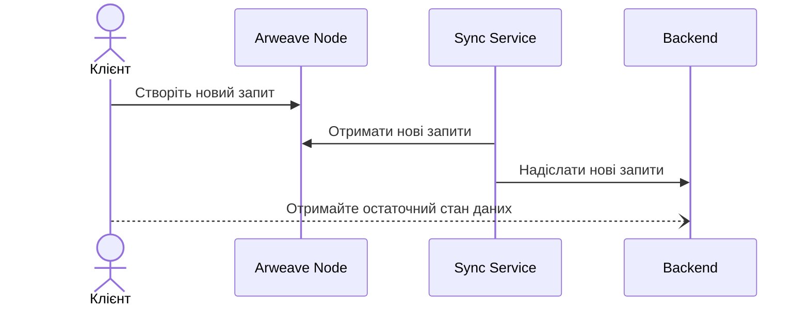

# dApp

## Аутентифікація 

Аутентифікація в децентралізованих додатках здійснюється за допомогою криптографічних підписів, що дозволяє уникнути розкриття критично важливих даних клієнта серверу. Цей метод також забезпечує високу цілісність даних, оскільки користувачі можуть перевірити справжність кінцевого стану даних за допомогою криптографічних підписів.

### Адреса 

Адреса — це унікальний ідентифікатор публічного криптографічного ключа, що складається з 32 байтів хешу [BLAKE3-256](https://uk.wikipedia.org/wiki/BLAKE\_\(%D1%85%D0%B5%D1%88-%D1%84%D1%83%D0%BD%D0%BA%D1%86%D1%96%D1%8F\)) та зазвичай представлений у [шістнадцятковому](https://uk.wikipedia.org/wiki/%D0%A8%D1%96%D1%81%D1%82%D0%BD%D0%B0%D0%B4%D1%86%D1%8F%D1%82%D0%BA%D0%BE%D0%B2%D0%B0\_%D1%81%D0%B8%D1%81%D1%82%D0%B5%D0%BC%D0%B0\_%D1%87%D0%B8%D1%81%D0%BB%D0%B5%D0%BD%D0%BD%D1%8F) форматі, де до початку рядка додається префікс `0x`.

## Ліниве виконання 

Ліниве виконання — це обробка вхідних запитів клієнтів через певний проміжок часу. Цей проміжок часу, протягом якого запити можуть зберігатися чи бути обробленими, може варіюватися в залежності від потреб конкретного додатка. Запити, збережені у сховищі, можуть бути оброблені зовнішніми сервісами за їхньою власною умовою. Користувач може використовувати ці сервіси-виконавці, яким він довіряє для отримання остаточного стану даних, або у певних випадках визначати цей стан самостійно.

## Приклад архітектури 

Наданий приклад демонструє використання розумних контрактів та постійного сховища даних [Arweave](https://arweave.org) для створення децентралізованих додатків.

