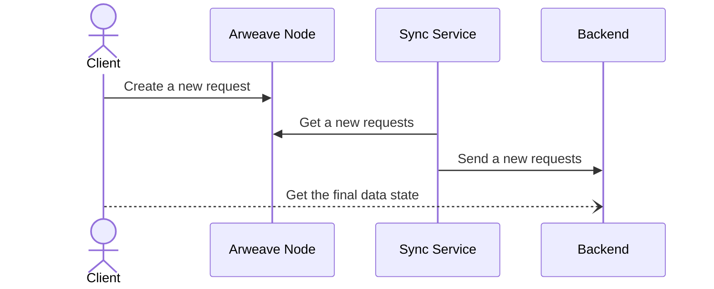

# dApp

## Lazy execution

Lazy execution is the processing of client requests over a certain period of time. This timeframe, during which requests can be stored or processed, may vary depending on the specific application's needs. Requests stored in the storage can be processed by external services according to their own conditions. The user can utilize these service-executors, in whom they trust to obtain the final state of the data, or in certain cases, determine this state independently.

## Example of architecture

The provided example illustrates the use of smart contracts and the permanent data storage of [Arweave](https://arweave.org) for the creation of decentralized applications.

