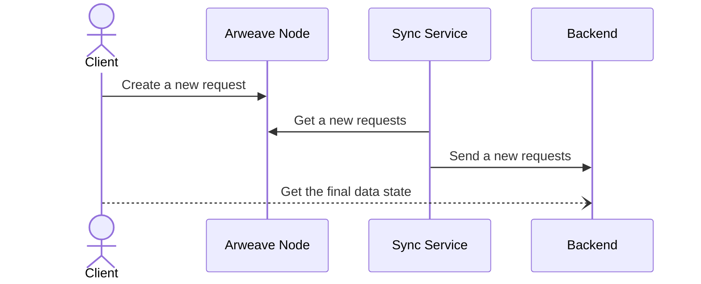

# dApp

## Authentication

Authentication in decentralized applications is accomplished through cryptographic signatures, allowing the avoidance of disclosing critical client data to the server. This method also ensures high data integrity, as users can verify the authenticity of the final data state through cryptographic signatures.

### Address

The address is a unique identifier of a public cryptographic key consisting of 32 bytes of [BLAKE3-256](https://en.wikipedia.org/wiki/BLAKE\_\(hash\_function\)) hash and is usually represented in [hexadecimal](https://en.wikipedia.org/wiki/Hexadecimal) format, where the prefix `0x` is added to the beginning of the string.

## Lazy execution

Lazy execution is the processing of client requests over a certain period of time. This timeframe, during which requests can be stored or processed, may vary depending on the specific application's needs. Requests stored in the storage can be processed by external services according to their own conditions. The user can utilize these service-executors, in whom they trust to obtain the final state of the data, or in certain cases, determine this state independently.

## Example of architecture

The provided example illustrates the use of smart contracts and the permanent data storage of [Arweave](https://arweave.org) for the creation of decentralized applications.

